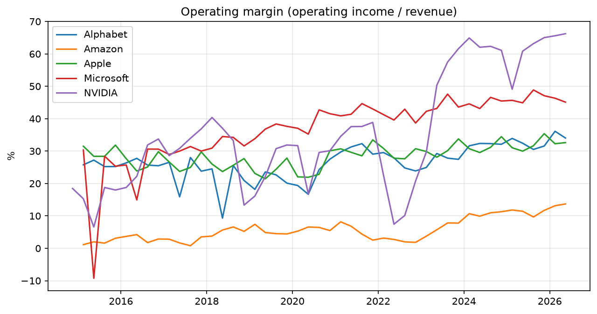
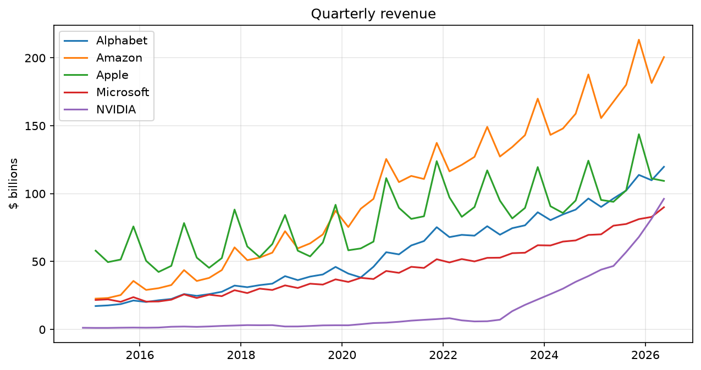
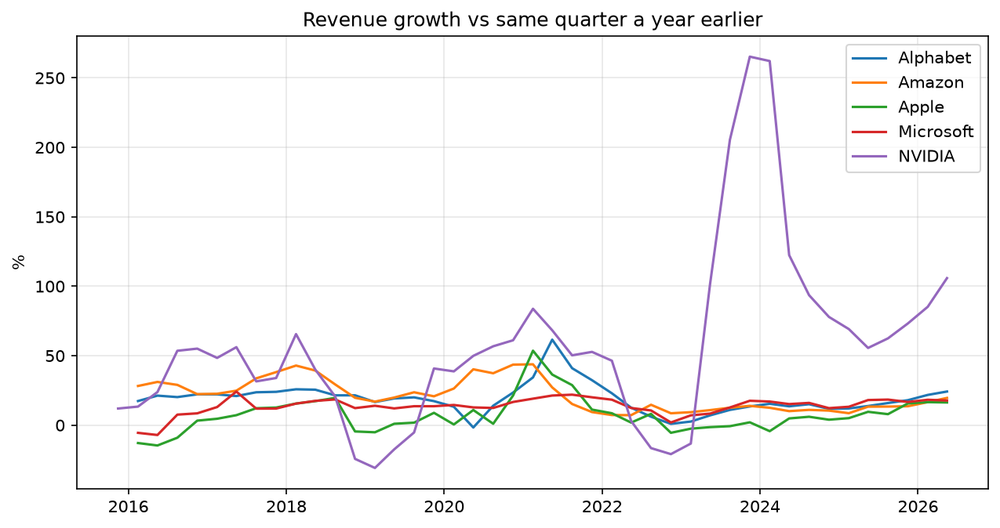

# SEC Financials Pipeline

An ETL pipeline that extracts quarterly financial results for five large US tech companies (Apple, Microsoft, Alphabet, Amazon and NVIDIA) from the SEC's official API, transforms them into one consistent dataset with Python, loads them into a DuckDB star-schema warehouse, and analyses them with SQL.



## About me

My name is Brian Luna, and my background is mainly in maths, physics and finance (BSc Theoretical Physics, PG Dip Financial Mathematics, MSc Financial Engineering). I've worked in IT consultancy in a range of roles, including automation, development and data engineering. 


## Why I'm applying

I want to build on my data engineering experience and bring my skills up to date with current tools and practices. This programme's mix of intensive training and real client work is a good fit: my consultancy background means I'm used to working with clients and turning loosely defined requests into practical solutions, and I'd like the structure and feedback to take my technical skills further.

## What I built and who for

A dataset and set of analyses for anyone who wants to compare big tech companies quarter by quarter, such as an analyst or investor, without dealing with how messy the official filings are.

Every US public company reports its results to the SEC, which publishes them through a free API. But the raw data can't be compared directly:

- **Q4 is never reported.** Companies report the full year instead of a fourth quarter.
- **Companies use different financial years.** Apple's ends in September, Microsoft's in June, NVIDIA's in January.
- **The same figure is filed under different names**, and the names change over time.
- **Every figure is filed many times**, because each report repeats earlier results.

The pipeline fixes these problems, stores the result in a small warehouse, and uses SQL to compare the companies on **size** (revenue), **efficiency** (operating margin) and **growth** (revenue versus a year earlier).

## The data

**Source:** the SEC EDGAR API, [Company Facts endpoint](https://www.sec.gov/search-filings/edgar-application-programming-interfaces):

```
https://data.sec.gov/api/xbrl/companyfacts/CIK##########.json
```

It's free, with no API key. Each company is identified by its CIK (the SEC's company ID, padded to 10 digits), and one request returns every financial figure the company has ever filed, as a JSON file of about 4MB.

**Requirements and quirks I found:**
- **A `User-Agent` header with a name and contact email is required**, or requests are refused. This isn't on the API page; it's in the SEC's separate [fair access policy](https://www.sec.gov/search-filings/edgar-search-assistance/accessing-edgar-data), which also limits requests to 10 per second. The fetcher sends the header and pauses between requests.
- **The data is nested several levels deep**: `facts → us-gaap → tag name → units → USD → list of figures`, each with a start date, end date, value, form type and filing date.
- **The `fp` (fiscal period) field describes the filing, not the figure.** A Q2 report contains both "Q2 alone" and "first six months", both labelled `Q2`. Only the dates tell them apart.

**The raw data is committed** in `data/raw/` where it gets processed to staging. 
## How it works

```
EXTRACT           TRANSFORM               LOAD                          ANALYSE
fetcher.py   →    clean.py           →    load.py + sql/schema.sql  →   sql/*.sql → charts.py
data/raw/*.json   data/staging/           data/warehouse.duckdb         output/*.png
                  financials_long.csv     (star schema)                 output/annual_summary.csv
```

Settings shared by every step (companies, metrics, file paths) live in `config.py`, so adding a company is a one-line change.

### 1. Extract (`fetcher.py`)
Downloads one JSON file per company and saves it untouched. **Why keep raw data separate:** the transform can be rerun and changed without downloading again, and there's always an original to go back to.

### 2. Transform (`clean.py`, Python/pandas)
For each company and metric:

1. **Keep only official reports**: quarterly (10-Q) and annual (10-K) reports and their amendments. Other filings, such as 8-K press releases, repeat the same figures and aren't the official record.
2. **Label each figure by its length in days**: quarter, six months, nine months or full year. **Why ranges, not exact lengths:** Apple and NVIDIA count their year in weeks, so most quarters are 13 weeks, but a 53-week year has one 14-week quarter. I set the ranges around the lengths actually seen in the data (89–97 days for quarters), with a margin either side.
3. **Remove duplicates; newest filing wins.** Each figure reappears in later reports as a comparison: for Apple's net income, 338 raw rows came down to 123. **Why newest:** if a company corrects a figure, the later filing has the correction.
4. **Match duplicates on end date and period type.** I first matched on start and end date, but Microsoft filed its July–September 2016 quarter twice with start dates a day apart (1 and 2 July), so it appeared twice. Matching on end date and period type fixes this.
5. **Calculate Q4 = full year − first nine months**, matching the two by start date (the same financial year). Where a company reported Q4 directly, as in some older filings, the reported figure is used.
6. **Collect revenue from three tag names.** Revenue was renamed when a new accounting standard (ASC 606) came in around 2018, so Apple's revenue history is split across `SalesRevenueNet`, `Revenues` and `RevenueFromContractWithCustomerExcludingAssessedTax`. I left out other revenue-sounding tags (like `DeferredRevenueCurrent`) because they measure something different.

The output is a **long** staging table: one row per company, quarter and metric, keeping each value's **provenance**: which tag it came from, when it was filed, and whether it was reported or derived.

### 3. Load (`load.py` + `sql/schema.sql`, DuckDB)

The data is loaded into a star schema:

```
                 ┌────────────────┐
                 │  dim_company   │  who
                 └───────┬────────┘
┌────────────────┐ ┌─────┴──────────────────┐ ┌────────────────┐
│  dim_quarter   │─│    fact_financials     │─│   dim_metric   │
│  when          │ │ one row per company,   │ │  what          │
└────────────────┘ │ quarter and metric     │ └────────────────┘
                   │ value, is_derived,     │
                   │ source_tag, filed_date │
                   └────────────────────────┘
```

**Design decisions:**
- **Why a warehouse, and why DuckDB:** every question asked of this data is analytical (totals, trends, comparisons), which is what warehouse engines are built for. DuckDB is an analytical database that runs from a single file. The same SQL would move to Snowflake or BigQuery with minor changes at larger scale.
- **Quarters are aligned to the calendar.** Financial years differ between companies, so each period is assigned to the calendar quarter containing its midpoint. Apple's Oct–Dec quarter (its fiscal Q1) and Microsoft's Oct–Dec quarter (its fiscal Q2) both become 2025 Q4, and can be compared directly. I checked that no company ends up with two rows in the same calendar quarter.
- **Ratios are calculated in queries, not stored**, so they can never get out of step with the values they come from.
- **Every run rebuilds the warehouse from scratch** (`CREATE OR REPLACE`), so running the pipeline twice gives the same result. At this size, a few hundred rows, this takes under a second.

### 4. Analyse (`sql/*.sql` → `charts.py`)
Each SQL file answers one question:

| query | question | SQL used |
|---|---|---|
| `revenue.sql` | How much does each company sell per quarter? | view, unit conversion |
| `operating_margin.sql` | How much of each dollar of sales becomes operating profit? | calculated column |
| `yoy_growth.sql` | How fast is revenue growing compared with a year earlier? | `LAG` window function with `PARTITION BY` |
| `annual_summary.sql` | Yearly totals and margin per company | `GROUP BY`, `HAVING` (complete years only) |

Two details: growth is measured against **the same quarter a year earlier**, not the previous quarter, to remove seasonal swings like the holiday quarter. And the annual margin is **total operating income ÷ total revenue**, not an average of four quarterly margins, so large quarters carry their proper weight.

## Checking the results

- **Automatic checks** on every run: rows per company and metric, empty cells (0), duplicate rows (0) and duplicate facts in the warehouse (0).
- **Calculated Q4s match the companies' own press releases.** Apple's Q4 FY2025: revenue calculated as **\$102,466m** and net income as **\$27,466m**, both exactly as Apple reported.
- **Unusual values were investigated rather than assumed to be errors**, and each turned out to be a real event:
  - **Microsoft, April–June 2015:** −9% operating margin, from a \$7.5bn write-off of its Nokia phone business, matching Microsoft's reported operating loss of $2.1bn.
  - **Microsoft and Alphabet, 2017:** net income drops while operating income rises, because of one-off charges from the US tax reform in December 2017.
  - **Amazon, 2022:** a net loss despite an operating profit, from writing down its investment in Rivian.
  - **NVIDIA, 2022:** margin falls to about 16% on inventory write-downs when demand for gaming chips fell.
- **Calendar vs financial years:** `annual_summary.csv` uses calendar years, so Apple's 2025 revenue there (\$435.6bn) differs from its financial-year 2025 figure ($416bn). Both are correct; they cover different twelve-month periods.

## Results

| | |
|---|---|
|  |  |

- **Seasonality:** Apple's and Amazon's revenue spikes every October–December (new iPhones, holiday shopping). Microsoft and Alphabet grow smoothly, because subscriptions and advertising arrive evenly through the year.
- **Size vs efficiency:** Amazon has by far the most revenue (\$717bn in 2025) but the lowest margin (11%), because retail is expensive to run. Microsoft keeps 47 cents of every dollar of sales.
- **NVIDIA** grew revenue from \$27bn in 2022 to $216bn in 2025, peaking at about 265% year-on-year growth in early 2024 with demand for AI chips, and now has the highest margin of the five (60%).

The yearly figures are in `output/annual_summary.csv`.

## How to run it

Requires Python 3.10 or later.

```
pip install -r requirements.txt
python run_pipeline.py
```

To rebuild from the committed raw data without calling the API, run the later steps on their own:

```
python clean.py
python load.py
python charts.py
```

**Note:** before running `fetcher.py`, set `USER_AGENT` in `config.py` to your own name and email, as the SEC requires.

## Known limitations

- **Accounting basis around 2018.** When ASC 606 came in, companies restated full years on the new basis but not always every quarter, so a few 2016–2018 quarters may mix old and new bases.
- **The tag list is chosen for these five companies.** Other companies, or industries like banking, may file under different names.
- **Earnings per share isn't included**, because it can't be calculated for Q4 by subtraction: the number of shares changes during the year.

## What I would do next

- **Move the transform into SQL** (raw → staging → mart layers, e.g. with dbt), so the whole pipeline after extraction is SQL that can be tested and documented per model.
- **Look up companies by ticker** using the SEC's ticker-to-CIK file, so any company can be added without hard-coding IDs.
- **Load incrementally**: only fetch and add new filings instead of rebuilding everything, which would matter at hundreds of companies.
- **Add automated tests** for the cleaning rules, especially the Q4 calculation and duplicate handling.
- **An interactive dashboard** (e.g. Streamlit) so users can choose companies and metrics.

## Where AI helped

I used AI for the following

- helping me understand the API and CIK usage
- exploring the raw JSON before any cleaning was written;
- investigating the Microsoft 2015 dip, which I noticed in the chart, to confirm it was a real event
- Assisting me debug the SQL queries
- Doing exploratory analysis on the data set.
- ReadMe, comments and final checks of the project structure.
- Helping me solve spot the microsoft start date issue and to use the end date & period key 

## Project structure

```
config.py            shared settings: companies, metrics, file paths
fetcher.py           E: download raw data from the SEC
clean.py             T: clean into one long table
load.py              L: build the DuckDB warehouse
charts.py            run the SQL queries and draw the charts
run_pipeline.py      run all four steps in order
requirements.txt     Python packages needed
sql/
  schema.sql         star schema and the v_financials view
  revenue.sql        analysis queries
  operating_margin.sql
  yoy_growth.sql
  annual_summary.sql
data/
  raw/               raw JSON, exactly as downloaded
  staging/           financials_long.csv
  annual_summary.csv
output/              chart images
```

## What i would do next

- Make the analysis on an application using streamlit.
- increase number of companies.
- feature for allowing user to choose which companies they want to search via a menu
- clean UI design 